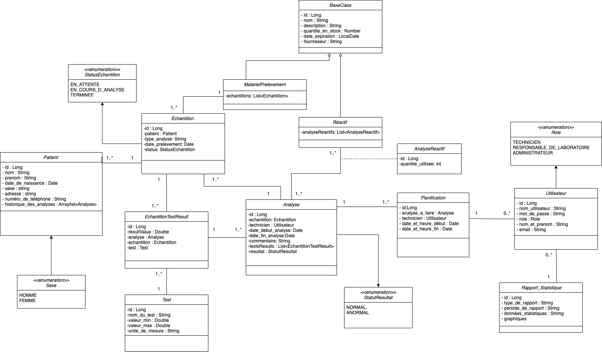
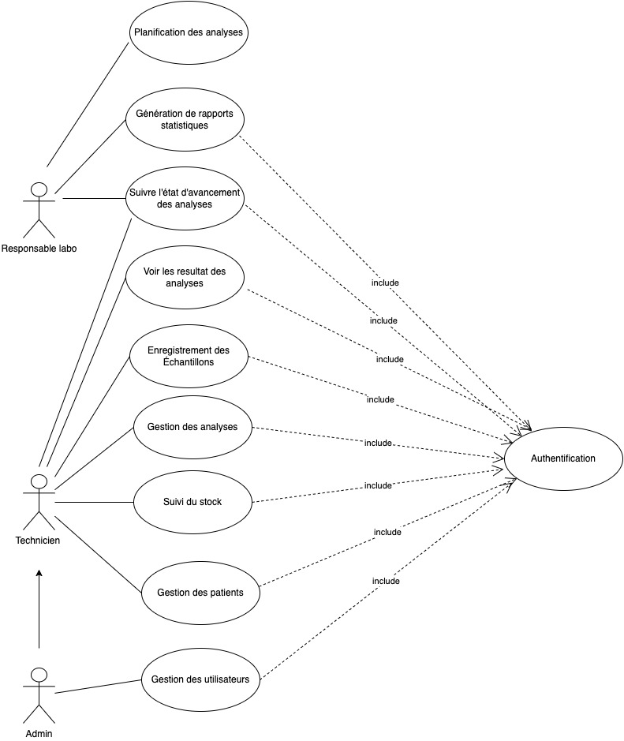

# README - Projet LabXpert

## Introduction

Bienvenue dans le projet LabXpert, un système de gestion complet conçu pour optimiser les opérations du laboratoire médical TechLab. Ce document fournit des informations sur le projet, son objectif, et inclut un diagramme de classes UML illustrant la conception du système.

## Diagramme de Classes UML

Le diagramme de classes ci-dessus présente la structure du système LabXpert. Il détaille les relations entre les différentes entités telles que les échantillons, les analyses en cours, les résultats, les patients, les réactifs, et les utilisateurs. Les classes principales, leurs attributs et méthodes, ainsi que les relations entre elles sont visuellement représentés pour offrir une vue d'ensemble de la conception du système.

## Diagramme de Cas d'Utilisation UML

Le diagramme de cas d'utilisation ci-dessus illustre les interactions entre les acteurs (utilisateurs) et le système LabXpert. Les différents cas d'utilisation, tels que l'enregistrement des échantillons, la gestion des résultats, la planification des analyses, et d'autres fonctionnalités clés, sont présentés pour fournir une compréhension globale des scénarios d'utilisation du système.

## Étapes d'Installation

1. **Clonage du Projet :**
   git clone [[URL_DU_REPOS]](https://github.com/chaimyaham/laboExpert.git)https://github.com/chaimyaham/laboExpert.git)
2. **Configuration de la Base de Données :**
- Créez une base de données PostgreSQL.
- Mettez à jour les informations de connexion dans le fichier `application.properties`.
3. **Compilation et Exécution :**
  mvn clean install

  ## Auteur

[Chaimaa MAHY]
